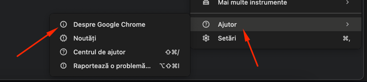
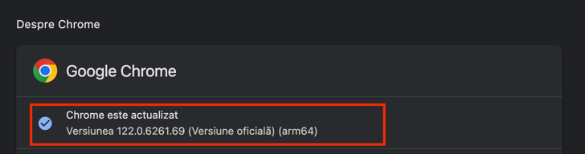

## Testing Setup Guide for "https://demoqa.com/login"

Follow these steps to clone and set up the testing environment for the website "https://demoqa.com/login" using the provided repository. This guide assumes you are using Chrome as your browser for testing.

### Step 1: Clone the Repository

First, clone the repository to your local machine using the following Git command:

```sh
git clone https://github.com/LunguIon/AlliedTestingDemo.git
```

Navigate into the cloned repository's directory:

```sh
cd AlliedTestingDemo
```

### Step 2: Verify Your Browser Version

Before running any tests, it's crucial to ensure that your testing environment is configured to match your browser's version. This guide focuses on Google Chrome.

1. **Find Your Chrome Version:**

    - Open Google Chrome.
    - Click on the three dots in the upper right corner to access the menu.
    
    - Go to "Help" > "About Google Chrome".
    
    - Your Chrome version will be displayed here. Note down this version number.
    

### Step 3: Update the Test Configuration

You need to update the test configuration to match your Chrome version.

1. **Modify `LoginTest.java`:**

    - Open the file `LoginTest.java` in your preferred IDE or text editor.
    - Locate line 18, where the browser version is specified.
    - Replace the existing version with the version number of your Chrome browser that you noted earlier.

   For example, if your Chrome version is 121.0.6167.184, the line should be updated to match this version:

   ```java
    WebDriverManager.chromedriver().browserVersion("121.0.6167.184").setup();
    driver = new ChromeDriver();
   ```

   **Note:** Ensure you have the correct `chromedriver` for your version of Chrome and that the path to `chromedriver` is correctly specified.

### Additional Notes:

- **ChromeDriver:**
    - If you haven't already, download the ChromeDriver that matches your Chrome version from the [ChromeDriver Downloads page](https://sites.google.com/chromium.org/driver/).
    - Ensure the path to `chromedriver.exe` in the `System.setProperty` method correctly points to where you've saved ChromeDriver on your machine.

- **Dependencies:**
    - Ensure all project dependencies are correctly installed. This typically involves running a build command or using a build tool like Maven or Gradle, depending on how the project is set up.

- **Running Tests:**
    - Follow the repository's instructions to run the tests. This usually involves using a specific command or running the test files through your IDE.

By following these steps, you should be able to set up and run the tests for the "https://demoqa.com/login" website using the provided repository. Ensure you regularly update your browser and ChromeDriver to the latest versions to avoid compatibility issues.
